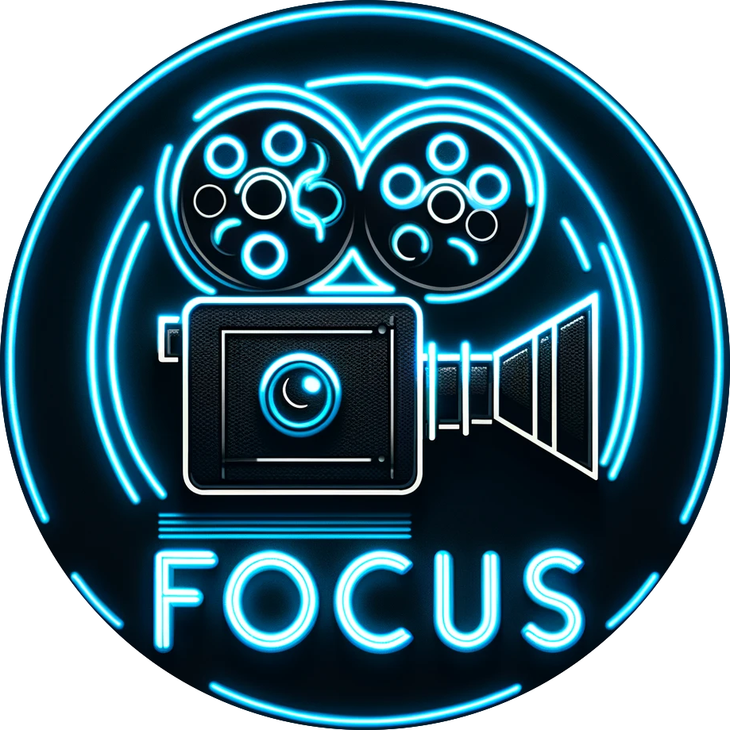

# FOCUS

## [See the App!](focus-frontend.netlify.app)



## Description

Whether you're a cinephile or someone looking for a great movie night option, FOCUS is your go-to platform for recommendations that resonate with your personal taste.

## User Stories

- **404** - As a user I want to see a nice 404 page when I go to a page that doesn’t exist so that I know it was my fault
- **homepage** - As a user I can select between films or series in order to see the reviews.
- **sign up** - As a user I want to sign up on the webpage so that I can see all the events that I could attend (not working yet)
- **login** - As a user I want to be able to log in on the webpage so that I can get back to my account (not working yet)
- **logout** - As a user I want to be able to log out from the webpage so that I can make sure no one will access my account (not working yet)
- **reviews list** - As a user I want to see all the events available so that I can choose which ones I want to attend
- **reviews create** - As a user I want to create an event so that I can invite others to attend

## Backlog Functionalities

As developers we would like to integrate an external API so that the list of movies can be updated and real suggestions can be given as to which movie or series are trending.

## Technologies used

As developers we use in the project like HTML, CSS, ReactJS, Node, Bootstrap, axios, Netlify and Adaptable

## (Optional) Routes

- GET /
  - renders the welcome
  - redirects to / if user logged in
- GET /Home
  - renders to select between movie or series
- GET /Movies
  - redirects to all movies in the database
- POST /Series
  - redirects to all series in the database
- GET /reviews
  - redirects to all user reviews
- POST /reviews
  - redirects to / if user is anonymous
  - body:
    - title movie
    - description
    - review

## Models

reviews model

```
title: String
description: String
```

Event model

```
owner: ObjectId<User>
name: String
description: String
reviews: String
```

## Links

## Collaborators

[Robert Cannon](https://github.com/Memoryman2022)

[Luis Felipe Rueda](https://github.com/unidrelyn)

### Project

[GitHub Project](https://github.com/Memoryman2022/Project-2)

[Web Site](https://focus-frontend.netlify.app/about)

### Trello

[Trello](https://trello.com/b/dxeUZLfx/react-movie-project)

### Slides

[Slides](https://slides.com/rob_ironhack/deck)
